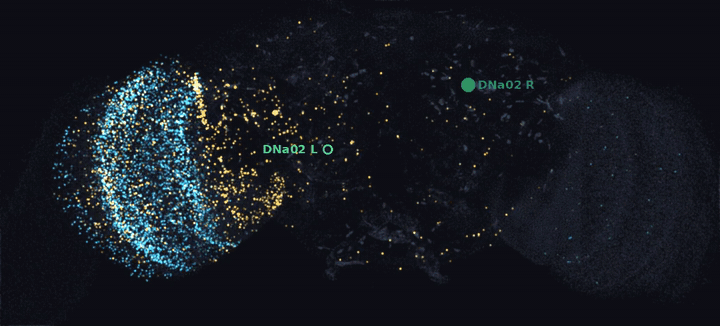
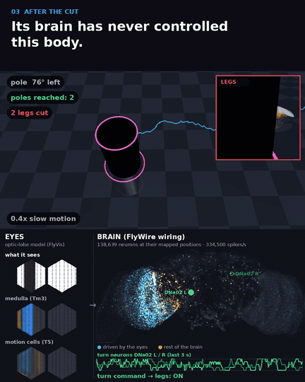
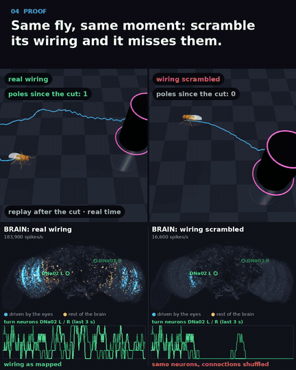
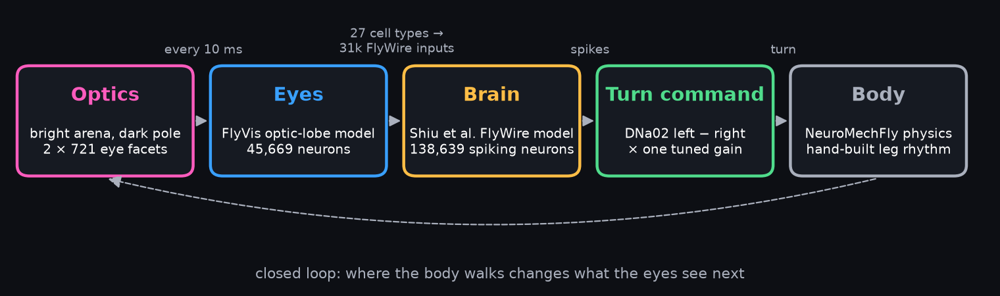
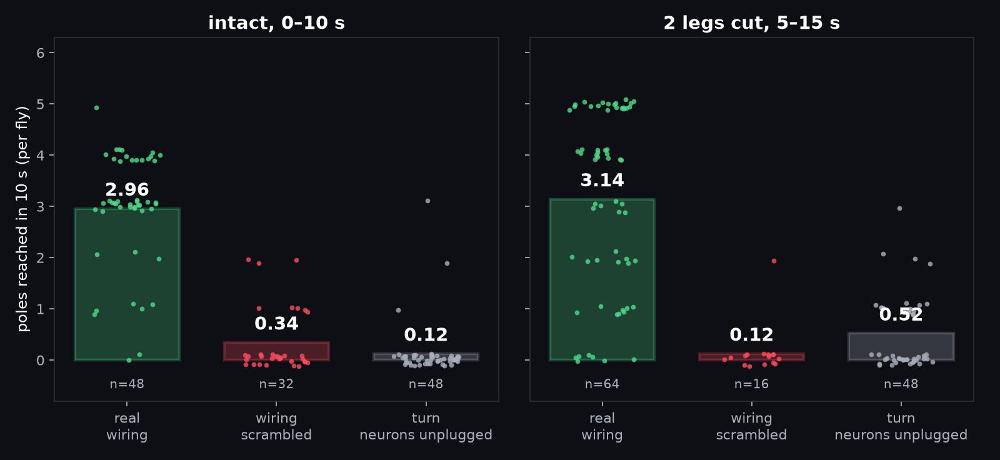

<h1 align="center">Are fruit flies zero-shot adapters? 🪰🧠</h1>

<p align="center">
A spiking model of the whole fruit fly brain, wired from the FlyWire connectome, sees through a model of the
fly's eyes and steers a simulated body toward dark poles. Then we cut two of its legs mid-walk.
It keeps finding the poles. Scramble its wiring and it can't.
</p>

<p align="center">
  
  <br><sub>Every dot is one of the 138,639 neurons at its mapped position in the fly brain. Every flash is a spike.
  Cyan: neurons driven by the eye model. Amber: the rest of the brain. Green: the two turn neurons (DNa02).</sub>
</p>

<table align="center">
  <tr>
    <td align="center"><br><sub><b>After the cut.</b> Eyes (left), brain (right), legs close-up (inset).</sub></td>
    <td align="center"><br><sub><b>Same fly, same moment.</b> Real wiring (left) vs scrambled wiring (right).</sub></td>
  </tr>
</table>

<p align="center"><a href="assets/fly_brain_zero_shot.mp4">▶ Full video (47 s)</a></p>

## TL;DR

- **The loop.** Eyes ([FlyVis](https://github.com/TuragaLab/flyvis)) → whole-brain spiking model on the
  FlyWire wiring ([Shiu et al. 2024](https://github.com/philshiu/Drosophila_brain_model)) → the brain's own turn
  neurons (DNa02, left vs right) → a simulated body ([NeuroMechFly](https://github.com/NeLy-EPFL/flygym)).
  Every 10 ms, all on one GPU, 16 to 64 flies at a time.
- **The injury.** Two legs (right front, left hind) are removed mid-walk. The brain was never tuned for that
  body. The injured flies reach as many poles as the intact ones.
- **The controls.** Each fly is cloned at the moment of the cut. With the connections scrambled (same neurons,
  same number of links) the turn neurons go silent and the fly misses the poles. Unplugging the turn neurons
  from the legs does the same.
- **Not from the brain.** The leg rhythm is a hand-built pattern generator, and two gains were tuned
  ([details below](#what-is-and-isnt-the-brain)).

## The loop

<p align="center"></p>

| Stage | What runs | Where |
|---|---|---|
| **Optics** | A bright arena (0.8) with one dark vertical pole (radius 2.5 mm). The brightness of each of 2 × 721 eye facets is computed from the fly's pose and each facet's calibrated viewing direction. | `vision_loop.py` |
| **Eyes** | The pretrained FlyVis optic-lobe model (`flow/0000/000`, 45,669 neurons), stepped every 10 ms for both eyes of every fly. | `vision_gate.py`, `eyemap.py` |
| **Handoff** | 27 FlyVis output cell types (T2, T3, T4a–d, T5a–d, Tm, TmY) drive the ~31,000 FlyWire neurons of the same types as Poisson inputs, column by column: 150 Hz × the cell's activity above background, scaled per type. | `eyemap.py`, `vision_loop.py` |
| **Brain** | The Shiu et al. leaky integrate-and-fire model of the FlyWire v783 connectome (138,639 neurons, 15 M connections), ported to [Warp](https://github.com/NVIDIA/warp) for batched GPU simulation. Unmodified weights. | `brain.py` |
| **Turn command** | DNa02 left minus right, averaged over 50 ms, sets the turn asymmetry of the leg rhythm: `asym = clip(−k·(L − R)/100 Hz, ±0.8)`, k = 2. | `vision_loop.py` |
| **Body** | NeuroMechFly on MuJoCo-Warp with a tripod pattern generator. A pole reached (≤ 3 mm) is replaced 25 mm ahead within ±60°. | `body.py`, `cpg.py`, `runner.py` |

## Results

<p align="center"></p>

Poles reached per 10 s (mean over flies; every dot is one fly; seeds 162000–162015 in every run):

| | real wiring | wiring scrambled | turn neurons unplugged |
|---|---|---|---|
| **Intact, 0–10 s** | 2.96 (n=48, 3 runs) | 0.34 (n=32, 2 shuffles) | 0.12 (n=48, 3 runs) |
| **2 legs cut, 5–15 s** | 3.14 (n=64, 4 runs) | 0.12 (n=16) | 0.52 (n=48, 3 runs) |

- **Robust to the injury.** After the cut, flies with their real wiring reach as many poles as intact flies.
- **The wiring matters.** Scrambled brains get the same eye input, but DNa02 falls from ~30 Hz to about 2 Hz or less.
  The signal from the eyes no longer reaches the turn neurons. This holds for every gain we tried (k = 1 to 8).
- **Reproduced from a fresh clone** of this repo, following the steps below (one more independent run, n=16):
  intact 2.81 poles vs 0.19 unplugged; after the cut 2.94–3.12 with real wiring vs 0.12 scrambled and 0.25
  unplugged. The gain grid picked k = 2 again.
- **Per-fly data** is in [`assets/results_per_fly.csv`](assets/results_per_fly.csv).

## What is and isn't the brain

Honest accounting, because it matters here:

- **Hand-built: the leg rhythm.** The FlyWire brain connectome has no nerve cord, and the nerve cord is where
  walking rhythm is generated. So a tripod pattern generator moves the legs, and the brain only sends the turn
  command. Walking pace is the pattern generator's, not the brain's.
- **Tuned: two settings.** (1) How strongly each FlyVis cell type drives its FlyWire neurons (its 99.9th
  percentile response to moving bars). (2) The gain k from DNa02 to turning (a grid on separate training flies).
  Neither was tuned on injured flies.
- **Hand-built: the optics.** The pole's image is computed analytically, not rendered.
- **Trained by others: the eye model.** FlyVis has connectome wiring, but its authors fitted its parameters to
  motion vision.
- **A model, not a fly.** This shows what the mapped wiring can do in simulation. It does not show how real
  flies recover from injury.
- **Not bitwise reproducible.** GPU atomics in both the brain and the physics mean reruns with the same seeds
  diverge per fly. The aggregate results replicate (see the run counts above).

## Run it yourself

**Needs:** Linux, an NVIDIA GPU (developed on an RTX 3070 Laptop, 8 GB), Python 3.12. On a machine without a
display, `export MUJOCO_GL=egl` before rendering the video. The first run compiles GPU kernels, which adds a few
minutes once.

```bash
git clone https://github.com/vib2810/fly-brain-zero-shot && cd fly-brain-zero-shot
uv venv --python 3.12 .venv && source .venv/bin/activate
uv pip install torch torchvision --index-url https://download.pytorch.org/whl/cu128   # same index for both; match your CUDA driver
uv pip install -e .
./scripts/download_data.sh   # Shiu connectivity, FlyWire annotations, FlyVis weights (pinned, checksummed)
```

Then, in order (timings on the RTX 3070 Laptop):

| Step | Command | Time | Writes |
|---|---|---|---|
| Sanity check: brain matches Shiu et al. (MN9 ≈ 70 Hz), flies turn toward a pole | `python -m flyloop.vision_loop check` | 2 min | log |
| Tune the turn gain on training flies | `python -m flyloop.vision_loop calib` | 6 min | `runs/vision_loop/calib.npz` |
| Brain vs unplugged, intact and with the leg cut | `python -m flyloop.vision_loop eval 2 0` | 12 min | `eval.npz` |
| Scrambled wiring, intact flies | `python -m flyloop.vision_loop shuffle 0` | 6 min | `shuffle0.npz` |
| Scrambled wiring at the cut (+ recordings for the video) | `python -m flyloop.vision_loop scramble 2 0` | 10 min | `eval_scramble.npz` |
| Render the video | `python -m flyloop.video` | 3 min | `runs/fly_brain_zero_shot.mp4` |
| Figures and per-fly table | `python scripts/make_figures.py` | seconds | `assets/` |

`python -m flyloop.vision_loop record 2 0` repeats `eval` and also records every spike, for a replicate
with video data.

## Repository layout

```
src/flyloop/
  brain.py        Shiu et al. LIF brain on the GPU (Warp), batched over flies
  data.py         FlyWire v783 neurons and connections
  eyemap.py       facet directions, FlyVis columns, FlyWire neuron -> FlyVis column map
  vision_gate.py  FlyVis loading, handoff neurons, open-loop stimuli
  vision_loop.py  the closed loop, the leg-cut clone, and every experiment above
  wiring.py       the scrambled-connectome null model
  clone.py        copies a running fly (body, pattern generator, brain) into an injured body
  body.py cpg.py runner.py records.py render.py   NeuroMechFly body, pattern generator, GPU runner
  video.py video_kit.py                            the video
data/eyemap/      derived eye maps (shipped); data/{shiu,flywire,flyvis} come from the download script
scripts/          download_data.sh, make_figures.py
```

**How the eye maps were made.** `ommatidia_dirs.npz`: each FlyGym eye facet's viewing direction, measured by
rendering a marker on a 5° grid. `flywire_columns.npz`: each FlyWire neuron of a handoff type is assigned to a
FlyVis column. Mi1 positions anchor the columns, and each other neuron takes the input-weighted direction of
its presynaptic partners. The code for both is in `eyemap.py`.

## Credit and prior work

- **[Eon Systems](https://eon.systems/updates/embodied-brain-emulation)** first put the Shiu brain model, with
  FlyVis vision, into a NeuroMechFly body (March 2026). This repo adds a controlled test: an unseen injury,
  clones, and scrambled-wiring and unplugged controls.
- Dorkenwald et al. 2024, *Neuronal wiring diagram of an adult brain*, Nature.
  [doi:10.1038/s41586-024-07558-y](https://doi.org/10.1038/s41586-024-07558-y)
- Schlegel et al. 2024, *Whole-brain annotation and multi-connectome cell typing of Drosophila*, Nature.
  [doi:10.1038/s41586-024-07686-5](https://doi.org/10.1038/s41586-024-07686-5)
- Shiu et al. 2024, *A Drosophila computational brain model reveals sensorimotor processing*, Nature.
  [doi:10.1038/s41586-024-07763-9](https://doi.org/10.1038/s41586-024-07763-9)
- Lappalainen et al. 2024, *Connectome-constrained networks predict neural activity across the fly visual
  system*, Nature. [doi:10.1038/s41586-024-07939-3](https://doi.org/10.1038/s41586-024-07939-3)
- Wang-Chen et al. 2024, *NeuroMechFly v2: simulating embodied sensorimotor control in adult Drosophila*,
  Nature Methods. [doi:10.1038/s41592-024-02497-y](https://doi.org/10.1038/s41592-024-02497-y)

## License

MIT for the code in this repository. The downloaded data and models keep their own licenses (see their
repositories).

<p align="center"><sub>Vibhakar Mohta, 2026</sub></p>
